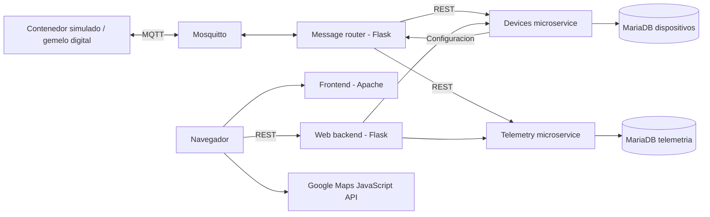

# IoT Cloud Platform

Plataforma IoT incremental para monitorizar contenedores conectados: adquisicion de datos en Raspberry Pi, simulacion de dispositivos, comunicacion MQTT, microservicios REST y visualizacion web.

El proyecto nace de practicas academicas y conserva su evolucion del hardware a una arquitectura distribuida. La fase final combina un simulador de contenedor con servicios de dispositivos y telemetria, bases independientes y una interfaz de consulta y configuracion.

## Arquitectura



El simulador de la fase 8 se conecta al broker de la fase 9. La fase 10 incorpora la web. Son despliegues independientes; los servicios de las fases 9 y 10 comparten la red Docker `iot_platform`.

## Tecnologias

| Area | Tecnologias y uso |
| --- | --- |
| Dispositivos | Raspberry Pi, Python, GPIO, DHT11, I2C, SPI, NFC, motores y servos |
| Comunicacion | Sockets TCP, MQTT, Mosquitto, JSON |
| Servicios | Python, Flask, REST APIs, Microservices |
| Datos | MariaDB, bases independientes por servicio |
| Infraestructura | Linux, Docker, Docker Compose |
| Visualizacion | HTML, CSS, JavaScript, jQuery, Google Maps |
| Cloud | Google Cloud Platform: entorno posible de ejecucion en VM Linux; Maps es la integracion implementada |
| Modelado | Digital Twins: simulacion del estado y la telemetria de un contenedor |

El repositorio no incluye Terraform ni automatizacion para provisionar infraestructura GCP.

## Evolucion por fases

| Fase | Directorios | Resultado |
| --- | --- | --- |
| Hardware y adquisicion | `ejercicio 1` a `ejercicio 4` | Raspberry Pi, sensores, LCD, NFC y actuacion |
| Concurrencia y eventos | `ejercicio 5` y `ejercicio 6` | Threads, motor e interrupciones |
| Contenerizacion | `ejercicio 7` | Simulador y unidad de control con sockets |
| Mensajeria | `ejercicio 8` | Broker MQTT, acceso y publicacion de telemetria |
| Servicios y persistencia | `ejercicio 9` | Microservicios de dispositivos y telemetria con MariaDB |
| Visualizacion y control | `ejercicio 10` | Mapa, consulta de medidas y configuracion web |

## Estructura

```text
ejercicio 1 ... ejercicio 6/   Hardware y concurrencia
ejercicio 7/                  ControlUnit y SensorSimulator
ejercicio 8/                  IoTContainer y servicios MQTT
ejercicio 9/IoTCloudServices/ Broker, router, microservicios y bases
ejercicio 10/IoTCloudServices/ Backend web y frontend
docs/                        Publicacion y textos para el portfolio
```

Los nombres originales se mantienen para conservar las rutas de construccion. Las fases 7 a 10 incluyen un README especifico.

## Funcionalidades

- Simulacion de temperatura, humedad, posicion, puerta y ventilacion.
- Solicitud de acceso, seguimiento de sesiones y aviso MQTT de desconexion inesperada.
- Enrutado MQTT hacia APIs HTTP.
- Persistencia y consulta de telemetria y configuracion por contenedor.
- Actualizacion de parametros desde la web mediante REST y MQTT.
- Visualizacion de posiciones con Google Maps.

## Despliegue local

Requisitos: Docker Engine y Docker Compose. Los scripts de hardware necesitan Raspberry Pi, cableado y librerias de los perifericos; no son necesarios para el simulador. Los servicios Python usan imagenes Python 3.12.

Ejecuta cada bloque desde la raiz, en terminales separadas. En instalaciones antiguas sustituye `docker compose` por `docker-compose`.

### Servicios y bases de datos

```bash
cd "ejercicio 9/IoTCloudServices"
cp .env.example .env
# Edita .env y establece tus contrasenas locales.
docker compose -p iot-services up -d --build
```

Este despliegue crea `iot_platform`. Manten `MYSQL_DATABASE=fic_data`: los SQL usan ese nombre. `MYSQL_PASSWORD` se transmite como `DBPASSWORD` a los microservicios. Las bases no tienen volumen persistente configurado: recrear sus contenedores puede borrar los datos de la demostracion.

### Contenedor simulado

```bash
cd "ejercicio 8/IoTContainer"
cp .env.example .env
# MQTT_SERVER_ADDRESS: IP o DNS del host del broker.
# Copia MQTT_DEVICE_* del .env de la fase 9.
docker compose -p iot-device up -d --build
```

`localhost` dentro del simulador es el propio contenedor. En Linux, configura la IP LAN del host del broker; en una VM, usa su IP o DNS accesible y configura el firewall.

### Interfaz web

```bash
cd "ejercicio 10/IoTCloudServices"
cp .env.example .env
# Establece GOOGLE_MAPS_API_KEY para habilitar el mapa.
docker compose -p iot-web up -d --build
```

Abre `http://localhost/`. El backend web escucha en `http://localhost:5003/`. La clave de Maps se aplica al arrancar el frontend sin editar HTML; tras cambiarla, ejecuta `docker compose -p iot-web up -d --force-recreate webapp_frontend`.

| Puerto | Servicio |
| --- | --- |
| 80 | Frontend |
| 1883 | Mosquitto |
| 5000 | Router |
| 5001 | API de telemetria |
| 5002 | API de dispositivos |
| 5003 | Backend web |

Los nombres de proyecto `-p` evitan colisiones entre carpetas llamadas `IoTCloudServices`. Los brokers de las fases 8 y 9 son alternativas: no arranques ambos en el puerto 1883.

Consulta logs con `docker compose -p NOMBRE logs -f` en su directorio. `depends_on` no garantiza que MariaDB o MQTT esten listos; si un servicio falla durante el arranque, revisa los logs y reinicialo. Para detener la plataforma ejecuta `docker compose -p NOMBRE down` en cada directorio: primero `iot-web`, despues `iot-device` y finalmente `iot-services`.

## Seguridad y limites

- Se excluyen `.env`, credenciales cloud, claves, certificados, caches y archivos del editor.
- Los valores predeterminados son ejemplos publicos: cambia las contrasenas y sincroniza broker y simulador.
- MQTT tiene autenticacion, pero este despliegue no incorpora TLS ni ACL por dispositivo.
- Las APIs REST no tienen autenticacion y usan el servidor de desarrollo Flask; CORS es permisivo. Limita el acceso de red durante las pruebas.
- Maps usa una clave visible en el navegador: restringe referentes HTTP y APIs autorizadas en Google Cloud. No uses credenciales de cuenta de servicio.
- Es un prototipo academico: faltan endurecimiento, reintentos, healthchecks, observabilidad y pruebas de integracion para produccion.
- Los enunciados no forman parte del estado actual. El historial debe revisarse por separado: `.gitignore` no elimina versiones antiguas.

## Aprendizajes

El recorrido permite estudiar adquisicion y actuacion, concurrencia, desacoplamiento mediante MQTT, contratos JSON/REST y separacion de responsabilidades y datos por microservicio. El despliegue muestra la importancia de redes Docker, configuracion por entorno y coordinacion de dependencias. La web cierra el ciclo entre medidas, persistencia y configuracion del dispositivo.

Consulta [la guia de portfolio](docs/PORTFOLIO.md) para preparar GitHub, CV y LinkedIn.

Las comprobaciones de construccion y del flujo MQTT/REST estan registradas en [la verificacion local](docs/VERIFICATION.md).
